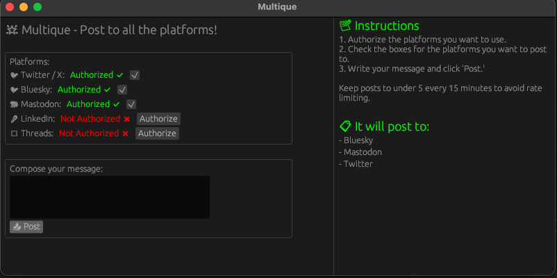

# Multique

A social media management tool, enabling you to post the same message to multiple platforms.



## Platforms implemented

- Twitter / X
- Bluesky
- Mastodon (Fosstodon)

## Platforms in progress

- LinkedIn
- Threads

## Platforms targetted, but unsupported

- Cara (Artists)

## Configuration

Create a `.env` file in the root of the project.  It should contain:

```sh
# Bluesky
BLUESKY_USERNAME=youremail
BLUESKY_PASSWORD=yourpassword

# Twitter
# https://developer.twitter.com/en/portal/dashboard -> Default project -> App settings -> Keys and tokens
# User authentication settings -> Read and write + Native App + http://localhost/callback callback + https://github.com/<your username> for website URL
TWITTER_CLIENT_ID=
TWITTER_CLIENT_SECRET=
TWITTER_REDIRECT_URI=http://localhost/callback

# Mastodon
# Preferences -> Development -> New Application.  Scopes: read, write:statuses
MASTODON_CLIENT_ID=yourclientid
MASTODON_CLIENT_SECRET=yourclientsecret
```

## Usage

This is still in development, so it has a few rough edges.  Authentication is handled on the CLI.

```sh
cargo run
```

Follow the instructions to authorize an app.  For Mastodon and Twitter, you will need to visit the URL provided, authorize the app, and provide a code back to the CLI.  For twitter, you'll copy this code from the URL you're redirected to, whereas Mastodon will appear in the website.